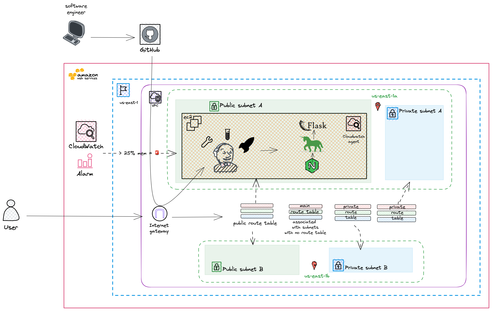

# Deploying Jenkins and a Flask app on an EC2 in a VPC

***
This is a guide to manually deploy Jenkins along with a Flask application on an EC2 instance housed within an AWS VPC. The goal of these steps is to create an environment on AWS with a Continuous Integration (CI) and Continuous Deployment (CD) processes.

1. VPC Creation: Craft an isolated Amazon VPC.
2. EC2 Configuration: Set up an EC2 instance.
3. GitHub Integration: Integrate GitHub tokens for Jenkins and establish webhooks.
4. Jenkins Deployment: Install Jenkins and address its core dependencies.
5. Web Server Setup: Configure NGINX as the web server for the Flask application.
6. Monitoring with CloudWatch: Implement monitoring using AWS Cloudwatch.
7. Jenkins Pipeline Activation: Modify the Jenkins file to initiate the CI/CD pipeline.

There are also suggestions for further improvements, leaning towards automation***



## Creating an AWS VPC

1. Navigate to the VPC service in AWS
2. Click on create VPC
3. We can stick with the standard settings
- Consider adding a tag
4. We are not using S3 in this infrastructure so we can select 'None' in the VPC endpoints setting
5. Click 'Create VPC' ☁️

## Create an EC2

This will host the Jenkins server and the Flask application

1. Navigate to the EC2 service
2. Click 'Launch Instance'
3. Name you instance
4. Select you operating system, Ubuntu
5. Select an instance type, I am using a T2.medium
6. Select a key pair to be able to access your instance
7. Network Settings
   - Click 'Edit'
   - Select the VPC we created above
   - Select a public subnet
   - Auto-assign a public IP
   - Create Security Group
     * Give your security group a name, I called mine 'Deployment4VpcSG'
     * Add a port for SSH with a port range of 22
     * Add TCP ports for range 8000, 8080, and 80
8. Launch the instance

### Github tokens

Before you build the pipeline you'll need a Github token and use it on Jenkins so that it can pull the respository

- Navigate to your Github users setting
- Click on 'Developer Settings'
- Click on the 'Personal Access Tokens' dropdown and select 'Tokens (classic)'
- Click on the 'Generate new token' dropdown and select 'Generate new token (classic)
- Add an appropriate note like 'Jenkins Controller'
- You need full control of repo. (If you want to deploy with Jenkins select admin:repo_hook)
- SAVE THE TOKEN, you wont be presented with the token again

Add a webhook so that when we push to main it triggers a jenkins build

- Navigate to your repositories settings in Github
- Click on 'Webhook' and 'Add Webhook'
- Add {jenkins-server-ip:port}/github-webhook/. This comes with the Jenkins Github plugin

## Jenkins

We use Jenkins to build, test, and deploy the application. Java is a dependency for Jenkins and python, venv and pip are dependencies for the testing.
unzip apt package is used to unzip the awscli

Access your EC2 instance's terminal through instance connect. We'll set up the linux environment to install Jenkins.

[Official Jenkins Install docs](https://www.jenkins.io/doc/book/installing/linux/)

Update linux dependency managers

```bash
sudo apt-get update
```

```bash
sudo apt update
```

Install Java

- This is a jenkins dependency

```bash
sudo apt install fontconfig openjdk-17-jre
```

Install venv for python 3.10.
-This is used to create virtual python environment and run the pip commands for the test and build of the flask application

- This will also install python 3.10

```bash
sudo apt-get install python3.10-venv
```

- Install Pip, the package manager used by the python virtual environment

```bash
sudo apt-get install python3-pip
```

Install Jenkins

- These curl and apt-get commands downloads and installs jenkins

```bash
curl -fsSL https://pkg.jenkins.io/debian-stable/jenkins.io-2023.key | sudo tee \
  /usr/share/keyrings/jenkins-keyring.asc > /dev/null
echo deb [signed-by=/usr/share/keyrings/jenkins-keyring.asc] \
  https://pkg.jenkins.io/debian-stable binary/ | sudo tee \
  /etc/apt/sources.list.d/jenkins.list > /dev/null
sudo apt-get install jenkins
```

Start Jenkins service

```bash
sudo systemctl start jenkins
```

Access the Jenkins dashboard. We'll begin to build the pipeline. We are using a multibranch pipeline

- Retrieve admin password from /var/jenkins/secrets/initialAdminPassword
- Navigate to {public.ip}:8080 on your browser to configure the dashboard. You will be prompted for the admin password
- You will be prompted to install the recommended plugin or choose your own. Install the quick start jenkins plugins
- Install the'Pipeline Keep Running Step' plugin:

  - From your Jenkins dashboard navigate to Manage Jenkins > Manage Plugins and select the Available tab. Locate this plugin by searching for pipeline-keep-running-step.
- Navigate to 'New Item'
- Select Multibranch pipeline
- Name your pipeline
- You'll see an option called branch sources. Choose GitHub and enter your GitHub link and credentials.
- Under the Github section
- Click on 'Add' under the credential drop down, select Jenkins
- Click on the Kind dropdown select 'Username with password'
- Add your Github username to the username' field
- In the 'password' field add the GitHub token you generated
- Click 'Add'. The modal will close.
- You can now select your credential in the 'Credentials' dropdown
- In the 'Repository HTTPS URL' field add your repositories URL
- Remove all behaviors except 'Discover branches' and select 'all branches'

## NGINX Web Server

NGINX will be our HTTP Web server

Install NGINX

```bash
sudo apt install nginx
```

Edit the configuration file at ``/etc/nginx/sites-enabled/default``

```
  ###First change the port from 80 to 5000, see below:
  server {
  listen 5000 default_server;
  listen [::]:5000 default_server;
  }

  ####Now scroll down to where you see “location” and replace it
  ####with the text below:

  location / {
      proxy_pass http://127.0.0.1:8000;
      proxy_set_header Host $host;
      proxy_set_header X-Forwarded-For $proxy_add_x_forwarded_for;
  }
```

## Cloudwatch

We'll be using the AWS Cloudwatch to create an alarm that monitors Cpu, and memory usage that exceeds 25% respectively

Create an IAM service role. This role will give the Cloudwatch agent, which is installed on the EC2 server to gather and report metrics to Cloudwatch

- Nagivate to the IAM service
- Click on Roles
- Click 'Create a role'
- Select 'AWS service' and choose EC2
- Search for 'CloudWatchAgentAdminPolicy', select, and click 'next'
- Name the role something appropriate like 'CloudWatchAgentServerRole'
- Click 'Create role'

Attach security group to the EC2 instance

- Navigate to your instance in the EC2 service
- Click on 'Actions'
- In the dropdown, select 'Security' and then 'Modify IAM role'
- Select the IAM role we created and save

Download, install and configure the Cloudwatch Agent on the EC2 that will run Jenkins and the Flask Application

Download

```bash
wget https://amazoncloudwatch-agent.s3.amazonaws.com/ubuntu/amd64/latest/amazon-cloudwatch-agent.deb
```

Install

```bash
sudo dpkg -i -E ./amazon-cloudwatch-agent.deb
```

We'll use a wizard to create the Cloudwatch agent config file

```bash
sudo /opt/aws/amazon-cloudwatch-agent/bin/amazon-cloudwatch-agent-config-wizard
```

Selections

- 1. linux
- 1. EC2
- 1. root
- 2. no
- 2. no
- 1. yes
- 1. yes
- 1. yes
- 1. yes
- 3. 30s
- 2. standard
- 1. yes
- 2. no
- 1. yes
- /var/log/syslog
- default choice [syslog]
- default choice [{instance.id}]
- 2. 1
- 2. no
- 2. no

Start the agent

```bash
sudo /opt/aws/amazon-cloudwatch-agent/bin/amazon-cloudwatch-agent-ctl -a fetch-config -m ec2 -s -c file:/opt/aws/amazon-cloudwatch-agent/bin/config.json
```

Set up an alarm to inform you when memory usage is over 25%. You'll need to do this twice

- Navigate to the Cloudwatch service and click 'create alarm'
- Select 'create metric'
- Click on 'CWA agent'
- Search 'mem'
- Select 'mem_used_percent'
- In the condition, select 'Greater/Equal' as the alarm condition
- An include '25' in the threshold value input field
- Click next
- Click on the 'Create new topic' radio button
- Name your topic something like 'mem-over-25-percent'
- Include the emails that will receive an email if alarm is triggered
- click 'next'
- Name your alarm. I named mine the same as the topic
- click 'create alarm'
- You'll need to navigate to your email and confirm the email from the SNS topic. It's likely in spam

## Jenkins File

- Create a branch ``git checkout -b luis/jenkins-file``
- Change the Jenkins file to what's included here: [Repo-Jenkins-File](./Jenkinsfile)
- Save your changes.
  ```bash
  git add Jenkinsfile
  git commit -m "Jenkins changes"
  ```
- Merge your changes into main and push to the remote repo
  ```bash
  git checkout main
  git merge luis/jenkins-file
  git push
  ```

**This should trigger a build and consequentially an alarm**

- We configured our alarm to trigger at 25% of 4GB of RAM usage
- The build process, nginx, and application take about ~38% of 4GM of RAM
- This would crash a T2.micro which only has 1GB of RAM

## **Improvements**

- Write a script to install Jenkins
- Write a script to configure the NGINX server
- Creating a CDN with Cloudfront